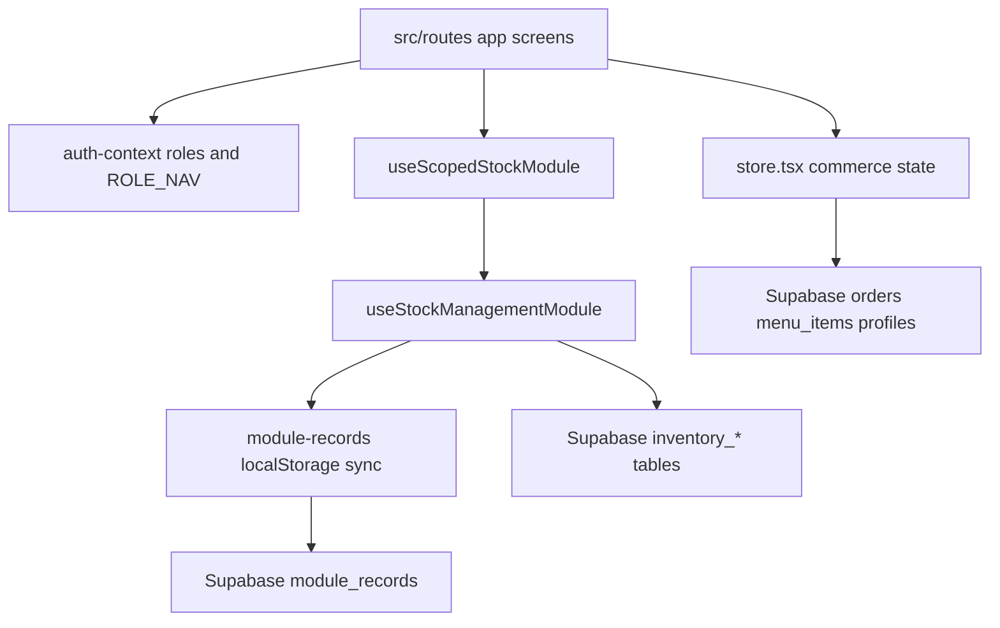
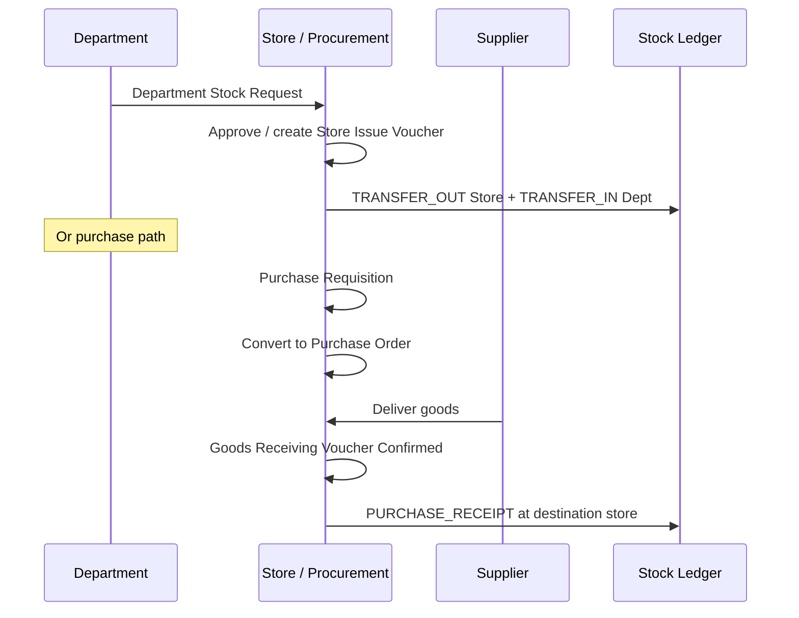
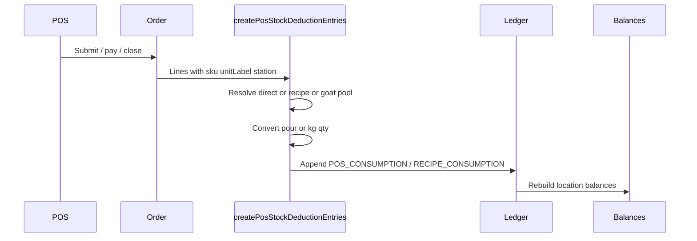

# EthioPlate / Buna Link — Business Logic Specification

**Purpose:** Code-backed reference of current business rules for rebuilding this system on the same stack (React, TanStack Router, Supabase).

**Source of truth:** Application TypeScript under `src/lib/` and routes under `src/routes/`, plus `supabase/migrations/`. Do **not** treat [`PROJECT_SUMMARY.md`](../PROJECT_SUMMARY.md) as authoritative — it describes an older demo-only view of the product.

**Status labels used in this document**

| Label | Meaning |
| --- | --- |
| **Transactional** | Enforced in pure business functions + UI; persists via `module_records` and/or normalized tables |
| **Hybrid** | Real logic in app; partial or dual persistence (local + Supabase) |
| **Demo / local** | UI exists; primarily in-memory or localStorage demo data |
| **Compatibility / legacy** | Older paths kept for migration or UI; prefer the newer path when rebuilding |

---

## Table of contents

1. [System overview](#1-system-overview)
2. [Architecture and state](#2-architecture-and-state)
3. [Persistence model](#3-persistence-model)
4. [Authentication and authorization](#4-authentication-and-authorization)
5. [Locations, stations, and workspaces](#5-locations-stations-and-workspaces)
6. [Commerce: menu, tables, orders, POS, KDS, payments](#6-commerce-menu-tables-orders-pos-kds-payments)
7. [Inventory core: master, ledger, balances, lots](#7-inventory-core-master-ledger-balances-lots)
8. [Procurement and distribution documents](#8-procurement-and-distribution-documents)
9. [POS stock deduction, recipes, pours, reservations](#9-pos-stock-deduction-recipes-pours-reservations)
10. [Department operations](#10-department-operations)
11. [Staff consumption](#11-staff-consumption)
12. [Reports, staff, and supporting modules](#12-reports-staff-and-supporting-modules)
13. [Data dictionary](#13-data-dictionary)
14. [Supabase schema and migrations](#14-supabase-schema-and-migrations)
15. [End-to-end flows](#15-end-to-end-flows)
16. [Invariants, validation, audit](#16-invariants-validation-audit)
17. [Test coverage](#17-test-coverage)
18. [Known gaps and legacy paths](#18-known-gaps-and-legacy-paths)
19. [Same-stack rebuild checklist](#19-same-stack-rebuild-checklist)

---

## 1. System overview

### 1.1 Product intent

Restaurant / F&B operations suite for Ethiopian hospitality (ETB, 15% VAT, bilingual EN/AM, Ethiopian calendar helpers). Brand/profile defaults live in [`src/lib/brand.ts`](../src/lib/brand.ts).

Core operational pillars:

- Front of house: POS, tables, orders, KDS, digital menu / QR
- Back of house: stock management (ledger-based), procurement, recipes, department consumption
- Management: roles, payments, reports, staff sales / staff consumption

### 1.2 Tech stack (current)

| Layer | Choice |
| --- | --- |
| UI | React 19, Tailwind CSS v4, Radix, Lucide |
| Routing | TanStack Router (file-based under `src/routes/`) |
| Runtime | Vite + TanStack Start |
| Backend | Supabase (Auth profiles, `module_records`, normalized inventory, POS tables) |
| Offline cache | `localStorage` via `module-records` (`bl_module_records_*`) |
| Session | `sessionStorage` user key (`bl_user`) |

### 1.3 Route / module map

| Route | Primary domain | Status |
| --- | --- | --- |
| `/login` | Auth | Hybrid |
| `/app` | Dashboard | Hybrid |
| `/app/pos` | POS / billing | Transactional |
| `/app/kds`, `/app/kds-history` | Kitchen display | Hybrid |
| `/app/tables` | Floor / tables | Hybrid |
| `/app/orders` | Order ops | Hybrid |
| `/app/reservations` | Reservations | Demo / local |
| `/app/menu` | Menu catalog | Hybrid (Supabase `menu_items`) |
| `/app/recipes` | Recipe BOM | Hybrid |
| `/app/stock-management` | Inventory ERP | Transactional |
| `/app/staff-consumption` | Manager staff meals/drinks | Transactional |
| `/app/suppliers` | Suppliers + procurement UI | Hybrid |
| `/app/payments` | Payment ledger | Hybrid |
| `/app/reports` | Analytics | Hybrid |
| `/app/staff`, `/app/staff-sales`, `/app/system-users` | HR / users | Hybrid |
| `/app/digital-menu`, `/app/qr-scanner` | Guest ordering | Hybrid / demo |
| `/app/room`, `/app/events`, `/app/catering` | Hotel / banquet | Demo / local |
| `/app/customers` | CRM / loyalty | Demo / local |
| `/app/receipts`, `/app/printer-settings`, `/app/settings` | Ops config | Hybrid |
| `/app/notifications` | In-app alerts | Demo / local |
| `/app/inventory` | Older inventory screen | Compatibility / legacy |

Module marketing descriptions: [`src/lib/modules.ts`](../src/lib/modules.ts).

---

## 2. Architecture and state



### 2.1 Provider boundaries

| Concern | Primary files |
| --- | --- |
| Auth user / roles / nav | [`src/lib/auth-context.ts`](../src/lib/auth-context.ts), login + `__root.tsx` |
| Shared commerce state | [`src/lib/store.tsx`](../src/lib/store.tsx) (re-exported by [`store.ts`](../src/lib/store.ts)) |
| Inventory module | [`src/lib/stock-management.ts`](../src/lib/stock-management.ts) `useStockManagementModule` |
| Workspace scoping | [`src/lib/inventory-scoped-module.ts`](../src/lib/inventory-scoped-module.ts), [`inventory-access.ts`](../src/lib/inventory-access.ts) |
| i18n | [`src/lib/i18n.ts`](../src/lib/i18n.ts), [`lang-context.ts`](../src/lib/lang-context.ts) |
| App shell / ROLE_NAV filter | [`src/routes/app.tsx`](../src/routes/app.tsx) |

### 2.2 Pure business vs UI

Prefer reconstructing domain behavior from pure functions in `src/lib/*` rather than route components. Routes compose hooks and call those functions.

High-value pure modules:

- `business.ts` — VAT, loyalty, Z-report helpers
- `orders-ops.ts` — order filters, progress, receipts eligibility
- `stock-management.ts` — ledger, balances, documents, POS deduction engine
- `pos-stock-close.ts` — order-line → stock mapping + close deduction
- `goat-butcher.ts` — goat registration and pool accounting
- `daily-consumption.ts` — Kitchen / Coffee House daily posting
- `staff-consumption.ts` — manager-recorded zero-revenue consumption
- `supplier-procurement.ts` — PR → PO → GRV queue helpers
- `bar-stock-view.ts` — VIP/Main Bar pour metrics
- `sales-analytics.ts` — dashboard period sales after closing

---

## 3. Persistence model

### 3.1 Dual-write / dual-read pattern (**Hybrid**)

1. **`module_records`** ([`004_module_records.sql`](../supabase/migrations/004_module_records.sql))  
   Generic `(module_key, record_id, data jsonb)` store. Client hook: [`src/lib/module-records.ts`](../src/lib/module-records.ts).
   - Reads hydrate into React state
   - Writes debounce (~750ms), chunk upserts, deadlock retry
   - Offline: `localStorage` + pending-sync queue when browser is offline

2. **Normalized inventory** ([`015_normalized_inventory.sql`](../supabase/migrations/015_normalized_inventory.sql)+)  
   Tables such as `inventory_items`, `inventory_ledger` (immutable), `inventory_lots`, `inventory_documents`, `goat_registrations`.  
   App dual-writes via [`src/lib/supabase/inventory-persistence.ts`](../src/lib/supabase/inventory-persistence.ts). Hydration prefers already-persisted `module_records` and only fills gaps from normalized snapshot.

3. **POS / menu / profiles** ([`001_core_pos.sql`](../supabase/migrations/001_core_pos.sql)+)  
   `profiles`, `menu_items`, `menu_categories`, `production_stations`, `orders`, `dining_tables`, etc. Wired through [`src/lib/supabase/pos-backend.ts`](../src/lib/supabase/pos-backend.ts) and related persistence helpers.

### 3.2 Inventory module keys

From `STOCK_MODULE_KEYS` in [`stock-management.ts`](../src/lib/stock-management.ts):

| Key | Domain records |
| --- | --- |
| `stock-items` | Stock master |
| `stock-ledger` | Immutable ledger entries |
| `stock-lots` | FEFO / batch lots |
| `stock-recipes` | Recipe BOM |
| `stock-closings` | Daily location closings |
| `stock-purchase-requisitions` | PR documents |
| `stock-purchase-orders` | PO documents |
| `stock-goods-receiving-vouchers` | GRV |
| `stock-store-issue-vouchers` | Store → department issue |
| `stock-store-transfer-vouchers` | Location transfers |
| `stock-goods-return-vouchers` | Returns |
| `stock-adjustment-vouchers` | Adjustments |
| `stock-cancellation-reversals` | Reversal vouchers |
| `stock-requests` | Department stock requests |
| `stock-counts` | Physical counts |
| `stock-inventory-settings` | POS/inventory settings |
| `stock-location-policies` | Per-location policies |
| `stock-pos-reservations` | Soft reservations |
| `stock-pos-shift-sessions` | POS shift packs |
| `goat-registrations` | Butcher goat docs |
| `daily-consumptions` | Kitchen/Coffee daily |
| `staff-consumptions` | Staff consumption vouchers |
| `staff-breakages` | Staff breakage vouchers |

When Supabase is configured, item/ledger seeds start empty and DB/catalog migrations become the opening source of truth.

### 3.3 Quantity and money conventions

- Quantities: round to 3 decimal places (`qty`)
- Money: round to 2 decimal places (`money`)
- Currency display: ETB via [`formatETB`](../src/lib/ethiopic.ts)
- VAT rate: **15%** (`VAT_RATE = 0.15`)
- Service charge (billing helper): **10% of subtotal**; VAT applies to food/bev subtotal only, not service ([`business.ts`](../src/lib/business.ts) `billBreakdown`)

---

## 4. Authentication and authorization

**Status:** Hybrid (Supabase profiles + client ROLE_NAV)

### 4.1 Roles

Defined in [`auth-context.ts`](../src/lib/auth-context.ts) and enforced in DB check constraints (e.g. migration `015`):

Administrator, Inventory Administrator, Branch Manager, Store Manager, Supervisor, Cashier, Waiter, Kitchen Staff, Bar Staff, Bartender, Butcher Staff, Butcher House Staff, Coffee House Staff, Department Manager, Inventory Staff, Storekeeper, Reception, Hotel Staff, Procurement Officer, Chef, Event Coordinator, Accountant, Auditor.

### 4.2 Route visibility

`ROLE_NAV` maps each role to allowed `/app/*` paths. Shell hides nav items and redirects unauthorized routes.

### 4.3 Inventory access context

[`inventory-access.ts`](../src/lib/inventory-access.ts) builds `InventoryAccessContext`:

- `canViewAllLocations` — managers / admins / auditors (policy-dependent)
- `assignedLocations` — from role defaults or profile assignment (`assignedStore`, `assignedInventoryLocations`)
- Permission flags: approve requests, dispatch, receive, adjust, view cost, etc.

Role → default locations (examples):

| Role | Default stock locations |
| --- | --- |
| Bartender | VIP Bar |
| Bar Staff | Main Bar |
| Kitchen Staff / Chef | Kitchen |
| Butcher Staff / Butcher House Staff | Butcher |
| Coffee House Staff | Coffee House |
| Storekeeper / Inventory Staff | Store 1 |

### 4.4 Staff consumption and breakage

Every signed-in role can open `/app/staff-consumption` and submit their own consumption or breakage. `STAFF_CONSUMPTION_MANAGER_ROLES` (Administrator, Branch Manager, Supervisor, Department Manager, Store Manager, Inventory Administrator) can approve, post, reverse, record for other staff, and view reports via `canManageStaffConsumption(role)`.

### 4.5 Stock master catalog edits

`canManageStockMasterCatalog` / `canManageStockMasterItem` — central store managers and admins; department users generally read department stock, request/receive, and post department-specific consumption.

---

## 5. Locations, stations, and workspaces

### 5.1 Stock locations (inventory)

Canonical list `STOCK_LOCATIONS`:

- Central: `Store 1`, `Store 2`
- Operational: `Main Bar`, `VIP Bar`, `Kitchen`, `Butcher`, `Coffee House`

**Critical mapping:** UI label for stock location `Butcher` is **"Butcher House"** (`stockLocationLabel`). Parsing `"Butcher House"` returns stock location `"Butcher"`.

### 5.2 Production stations (menu / KDS)

Menu `station` is a production/KDS station name (e.g. `Butcher House`, `Main Bar`, `VIP Bar`, `Kitchen`, `Coffee House`). Seed migration `031` deactivates duplicate production station `"Butcher"` and keeps **"Butcher House"** only.

Station routing helpers: [`stations.ts`](../src/lib/stations.ts) (legacy Hot/Cold/Grill → Kitchen/Butcher House).

### 5.3 Workspaces

`InventoryWorkspace = "all" | StockLocation`. Stock Management URL search param `?workspace=` selects effective workspace via `resolveEffectiveWorkspace`. Department users are locked to assigned operational locations; managers can switch.

Department-specific tabs: butcher gets goat processing; Coffee House / Kitchen get daily consumption; bars get bar stock view (`supportsBarStockView`, `supportsDailyConsumption`, `supportsRecipeBom`).

---

## 6. Commerce: menu, tables, orders, POS, KDS, payments

### 6.1 Menu catalog (**Hybrid**)

Entity: `MenuItem` in [`demo-data.ts`](../src/lib/demo-data.ts) / Supabase `menu_items`.

Important fields:

- `price`, optional `vipPrice`, `singlePrice`, `doublePrice` (spirit pours)
- `pricingMode`: `unit` | `kg`
- `unitLabel`, `defaultQty`, `qtyStep`
- `stockSku` — link to inventory item id
- `stockDeductionLocation` — operational stock location override
- `stockDeductionRule`: `direct` | `recipe`
- `station` — production station

VIP seating can use VIP price; spirits use bottle/single/double modes (see pour section).

### 6.2 Tables and seating (**Hybrid**)

Tables have areas (Main / VIP / etc.). POS can assign an order to a table; settlement can free the table. Exact table state machine lives in store + tables route.

### 6.3 Order lifecycle (**Transactional** in app state; **Hybrid** persistence)

Statuses (`OrderStatus`):

```text
PENDING_CASHIER → NEW → PARTIALLY READY → READY TO SERVE
  → RECEIPT_GENERATED → CLOSED
Terminal also: CANCELLED | RETURNED
```

Payment statuses: `Unpaid` | `Paid` | `Partially Paid` | `Refunded`.

Final statuses: `CLOSED`, `CANCELLED`, `RETURNED` (`isFinalOrderStatus`).

Order sources: Dine-in, Takeaway, Room, Delivery, QR.

Order lines carry station tickets, optional `stockSku`, `unitLabel`, `stockDeductionLocation`, `stockDeducted`, prep timestamps.

Ops helpers: [`orders-ops.ts`](../src/lib/orders-ops.ts) — filters, elapsed timers (default prep target 20 minutes), station progress, receipt eligibility (`canGenerateReceipt`), CSV export, kitchen ticket text.

Void / return field support: migrations `010`, `011`.

### 6.4 POS (**Transactional**)

Route: [`app.pos.tsx`](../src/routes/app.pos.tsx).

Typical flow:

1. Select menu items (category/search; EN/AM names)
2. Choose serving mode (bottle / single / double / kg portion where applicable)
3. Assign table / waiter metadata
4. Submit → station tickets / cashier accept path
5. Take payment (methods in `PAYMENT_METHODS`: cash, CBE, Telebirr, Dashen, BOA, Awash, MPESA, mixed, …)
6. Generate receipt; credit loyalty if customer matched
7. Close → stock deduction via `pos-stock-close` / `createPosStockDeductionEntries`

Billing helpers: `billBreakdown`, `earnPoints` (1 point per ETB 10), tiers Bronze→Platinum.

### 6.5 KDS (**Hybrid**)

Stations receive tickets from orders. Staff mark lines done; order progresses to partially ready / ready. History route retains past tickets.

### 6.6 Payments & Z-report (**Hybrid**)

Payment ledger entries feed `buildZReport` (gross, VAT extract, cash variance). Verify-ET integration exists under `verify-et` / API functions for Ethiopian fiscal verification where configured.

---

## 7. Inventory core: master, ledger, balances, lots

**Status:** Transactional (client engine) + Hybrid persistence

### 7.1 Stock master (`StockManagedItem`)

- Identity: `id` (often `stk-*`), name, category, `baseUnit`
- Costs: purchase / selling / vip / standard / weighted average behavior via settings
- `preferredLocation`, reorder level, conversions, beer tiers, bottle volume / doubles per bottle for spirits
- Quantity **is not edited directly** on save — opening and movements come from the ledger

### 7.2 Immutable ledger (`StockLedgerEntry`)

Append-only. Types:

| Direction | Types |
| --- | --- |
| Incoming | `OPENING_BALANCE`, `PURCHASE`, `PURCHASE_RECEIPT`, `GOAT_REGISTRATION`, `TRANSFER_IN`, `STORE_RETURN`, `DEPARTMENT_RETURN`, `CANCELLATION_REVERSAL` |
| Outgoing | `TRANSFER_OUT`, `POS_CONSUMPTION`, `RECIPE_CONSUMPTION`, `MANUAL_DEDUCTION`, `WASTE`, `DAMAGE`, `EXPIRY`, `STOCK_COUNT_ADJUSTMENT`, `MANUAL_ADJUSTMENT`, `DAILY_CONSUMPTION`, `STAFF_CONSUMPTION` |
| Other | `ADJUSTMENT`, `EXPENSE`, `CLOSING` |

Validation: `validateStockLedgerEntry` — item exists, unit convertible, sufficient qty unless `allowNegativeStock`, transfer endpoints required and distinct.

DB: `inventory_ledger` trigger rejects updates/deletes (immutable).

### 7.3 Balances

`buildLocationBalances` derives on-hand, reserved, available, inventory value per item×location from ledger + lots + transfers + POS reservations + location policies.

Sellable qty = physical − reserved (`getSellableStockQuantity`).

### 7.4 Lots / FEFO

`StockLot` statuses: Available, Quarantine, Expired, Blocked, Recalled. Issuable lots must be Available, not expired, qty > 0. Goat pools use lots keyed by registration reference for attribution.

### 7.5 Settings

`InventorySettingsRecord`: costing method (Weighted Average / FIFO / Standard Cost), allow negative stock, POS reservation trigger, POS deduction timing, OOS behavior defaults.

---

## 8. Procurement and distribution documents

**Status:** Transactional document state machines in `stock-management.ts` + UI in stock management / suppliers.

### 8.1 Document types

See `INVENTORY_DOCUMENT_TYPES`: Purchase Requisition, Purchase Order, Goods Receiving Voucher, Store Issue Voucher, Store Transfer Voucher, Department Stock Request, Goods Return Voucher, Stock Adjustment / Wastage / Damage vouchers, Physical Stock Count, Cancellation Reversal, Daily Consumption, Staff Consumption.

### 8.2 Typical procurement chain



PR statuses: Draft → Submitted → Under Review → Approved / Partially Approved / Rejected → Converted to Purchase Order / Cancelled.

PO statuses: Draft → Submitted → Approved → Partially Received / Received (+ Cancelled paths).

GRV: Draft → Confirmed / Cancelled. Confirm posts receipt ledger lines and may create supplier payable expense helpers (`supplier-procurement.ts`).

### 8.3 Distribution

- **Store Issue Voucher:** Store → operational department; creates transfer-like ledger movements
- **Store Transfer Voucher:** any location pair with dispatch / partial receive statuses
- **Department request:** requesting department + requested source store; priorities Normal/High/Urgent
- **Returns:** store return / department return reasons and statuses
- **Adjustments / counts:** variance posts `STOCK_COUNT_ADJUSTMENT` / adjustment vouchers after approval
- **Cancellation reversal:** reverses prior ledger by reference (`createCancellationReversalVoucher`)

Workflow inbox: [`stock-workflow-inbox.ts`](../src/lib/stock-workflow-inbox.ts) surfaces actionable documents by role.

### 8.4 Suppliers

[`app.suppliers.tsx`](../src/routes/app.suppliers.tsx) + `supplier-procurement.ts`. Roles that can manage suppliers / create purchase requests / pay suppliers are gated (`canManageSuppliers`, `canPaySupplier`, …). PO store scope: migration `022`.

---

## 9. POS stock deduction, recipes, pours, reservations

### 9.1 Deduction engine (**Transactional**)

`createPosStockDeductionEntries` in [`stock-management.ts`](../src/lib/stock-management.ts):

- Resolves menu line → direct `stockSku` or recipe ingredients
- Goat menus remap via `resolveGoatPoolSkuForMenuItem` (limb / inside / bone)
- Chooses deduction location via station + preferred location + meat/butcher rules (`resolveStockDeductionLocation` family)
- Converts pour unit labels (Bottle / Single Shot / Double Shot) using bottle volume and doubles-per-bottle
- Writes `POS_CONSUMPTION` and/or `RECIPE_CONSUMPTION` ledger rows with order reference
- Optional `ledgerProfile` allows non-POS callers (staff consumption uses `STAFF_CONSUMPTION`)

Close path wrapper: [`pos-stock-close.ts`](../src/lib/pos-stock-close.ts) `ensurePosStockDeductedWithFallback` / `mapOrderLinesForStock`.

### 9.2 Recipes / BOM

`StockRecipe`: menu item name, output qty/unit, preparation station, `stockDeductionLocation`, ingredient lines (itemId, qty, unit, location), wastage %. Kitchen BOM UI behind `supportsRecipeBom`.

### 9.3 Bar pours / yield (**Transactional** for stock math)

- Bottle base unit with `bottleVolumeMl` and doubles-per-bottle (default 16)
- Single / double shots consume fractional bottle qty
- Remaining pours and sold btl/dbl/sgl metrics: [`bar-stock-view.ts`](../src/lib/bar-stock-view.ts), VIP Bar panel

### 9.4 Reservations

`PosStockReservation` statuses: Reserved → Consumed | Released. Trigger configurable (`order_submit` | `station_accept` | `prep_start`). Reserved qty reduces sellable availability without consuming until deduction timing.

### 9.5 OOS behavior

Per settings / menu: `block`, `warn_manager`, `allow_negative_authorized`, `auto_unavailable`. Negative attempts can be logged (`PosNegativeSaleAttempt`).

### 9.6 Void / cancel stock outcomes

Configured outcomes: `release_only`, `wastage`, `reversal` (`POS_VOID_STOCK_OUTCOMES`).

---

## 10. Department operations

### 10.1 Daily consumption — Kitchen & Coffee House (**Transactional**)

Module: [`daily-consumption.ts`](../src/lib/daily-consumption.ts).

- Departments: `Kitchen`, `Coffee House` only
- Document statuses: Draft → Posted
- Posting writes `DAILY_CONSUMPTION` ledger at department location
- Coffee House: POS may sell cups **without** cup SKU deduction; raw beans/tea/ginger/nuts/milk consumed via daily voucher with default yields (e.g. coffee beans 0.015 kg/cup)
- Workspace report compares POS cups vs estimated raw usage

### 10.2 Butcher House / goat processing (**Transactional**)

Module: [`goat-butcher.ts`](../src/lib/goat-butcher.ts). Location always `Butcher`.

**Pools (inventory SKUs):**

| SKU | Purpose | Typical menus |
| --- | --- | --- |
| `stk-goat-limb-meat` | Limb pool (front+back) | Shekla, Kurete |
| `stk-goat-inside-parts` | Inside parts | Yefyel, Collection Yefyel, Mlas Sember |
| `stk-goat-bones` | Bones for Kikl recipe | Kikl (recipe BOM) — optional; slim seed `031` may deactivate |

**Registration lifecycle:**

1. `registerGoatDirectPurchase` — validate kg breakdown, allocate unit cost from purchase price, insert `GOAT_REGISTRATION` ledger + lots + `GoatRegistration` doc (`active`)
2. POS sales attribute against lots / pools; usage tracked per registration
3. Status refresh: `active` → `depleted` when pools exhausted; `cancelGoatRegistration` reverses unused stock when allowed (`canModifyGoatRegistration`)

Registration fields: goat type, supplier, purchase price, front/back leg kg, inside kg, bone kg, waste kg, limb kg (= front+back), document/reference numbers.

**Business rule:** Goats enter **only** at Butcher (not via Store GRV/issue). Isolated from central purchasing.

Slim test catalog (`031`): limb + inside + demo registration; Kikl/bones removed for minimal testing (code still supports bones/Kikl when seeded by `027`/`028`).

### 10.3 Kitchen / Coffee ops panels

UI analytics panels summarize sales, low stock, recipe links, daily consumption — see `kitchen-ops.ts`, coffee house report builders.

### 10.4 Daily closing

`StockClosingRecord` per location/date. Dashboard “today” metrics reset after closing via `resolveDailyDashboardPeriodStart` / `isInDailyDashboardPeriod` so post-close movements start a new period.

---

## 11. Staff consumption

**Status:** Transactional  
Sources: [`staff-consumption.ts`](../src/lib/staff-consumption.ts), route [`app.staff-consumption.tsx`](../src/routes/app.staff-consumption.tsx).

### Rules

- All users submit their own consumption; managers can also record for another staff member (see §4.4)
- Select staff member + consumption type (Meal, Drink, Coffee, Alcohol, Testing, Management, Other) + reason
- Lines: menu item, serving variant, qty, station → mapped to `stockDeductionLocation` via `stationToDeductionLocation` (`Butcher House` station → `Butcher` stock)
- Submit → status **Submitted** (no ledger). Manager approve/`postStaffConsumptionDocument` uses same deduction engine as POS with ledger type **`STAFF_CONSUMPTION`**, reference `SC-…`
- **Revenue always ETB 0**; inventory cost tracked
- Statuses: Submitted | Rejected | Posted | Reversed; reverse creates cancellation reversal voucher + reversal document
- Staff breakage voucher (`SB-…`) is submitted the same way; approve posts **`DAMAGE`** ledger with staff attribution and optional charge-to-staff flag
- Separate from customer sales in reports (`buildStaffConsumptionReport`, dashboard summary on stock dashboard)

---

## 12. Reports, staff, and supporting modules

### 12.1 Reports (**Hybrid**)

[`reports-query.ts`](../src/lib/reports-query.ts) + [`reports-catalog.ts`](../src/lib/reports-catalog.ts) assemble sales, stock valuation, department stock, consumption, goat reports, etc. from store + inventory module inputs.

### 12.2 Staff / HR (**Hybrid**)

[`staff-management.ts`](../src/lib/staff-management.ts), routes for staff list, staff sales attribution, system users admin ([`staff-admin.server.ts`](../src/lib/supabase/staff-admin.server.ts)).

### 12.3 Notifications, events, catering, room, customers

Primarily demo/local store collections. Treat as optional when porting unless product scope requires them.

### 12.4 Printers / receipts

[`pos-printer.ts`](../src/lib/pos-printer.ts), [`stored-receipts.ts`](../src/lib/stored-receipts.ts), printer settings route.

---

## 13. Data dictionary

### 13.1 Identity patterns

| Entity | Typical id / number |
| --- | --- |
| Inventory item | `stk-*` |
| Menu item | slug or `m*` timestamp ids |
| Ledger entry | `sled-*` / `seed-*` / generated |
| Goat registration | `goat-reg-*`, document `GOAT-…`, reference `GOAT-GOAT-…` |
| Staff consumption | `SC-…` / `SC-REV-…` |
| Staff breakage | `SB-…` |
| Opening seed refs | `SEED-OB-*`, `SEED-SLIM-*`, `SEED-DEPT-*` |

### 13.2 Core relationships

```text
MenuItem.stockSku → StockManagedItem.id
MenuItem.station → production station (KDS)
OrderLine → MenuItem (+ unitLabel, stockDeductionLocation)
StockRecipe.ingredients[].itemId → StockManagedItem.id
GoatRegistration.referenceNo → inventory_lots.reference_no / ledger.reference_no
StaffConsumptionDocument.lines[].stockDeductionLocation → OperationalStockLocation
PurchaseOrder → GoodsReceivingVoucher → ledger PURCHASE_RECEIPT
```

### 13.3 Status cheat sheet

| Domain | Statuses |
| --- | --- |
| Order | PENDING_CASHIER, NEW, PARTIALLY READY, READY TO SERVE, RECEIPT_GENERATED, CLOSED, CANCELLED, RETURNED |
| Payment | Unpaid, Paid, Partially Paid, Refunded |
| Goat registration | active, depleted, cancelled |
| Daily consumption | Draft, Posted |
| Staff consumption | Submitted, Rejected, Posted, Reversed |
| Staff breakage | Submitted, Rejected, Posted, Reversed |
| Stock request | (see `STOCK_REQUEST_STATUSES`) includes Draft through Received / Rejected / Cancelled |
| Stock transfer | Draft → Dispatched → Partially Received → Received (+ Cancelled) |
| Stock count | Draft → In Progress → Submitted → Reviewed → Approved/Rejected → Posted |
| Lot | Available, Quarantine, Expired, Blocked, Recalled |

---

## 14. Supabase schema and migrations

Apply in numeric order under `supabase/migrations/`.

| Migration | Role |
| --- | --- |
| `001` | Core POS: profiles, stations, menu, tables, orders |
| `002`–`003` | Password login / staff auth |
| `004` | `module_records` |
| `005`–`008` | Menu categories / seeds |
| `009` | Extra roles |
| `010`–`011` | Order void / return fields |
| `013`–`014` | Menu→stock seed path; immutable ledger foundation |
| `015` | Normalized inventory tables + RLS |
| `016` | POS inventory settings / audit |
| `017` | Optional operational inventory tables |
| `018`–`019` | Inventory seed from stock list / menu |
| `020` | Admin user seed |
| `021` | Profile inventory assignment |
| `022` | Suppliers PO store scope |
| `023` | Menu `unit_label` |
| `024` | Stock-first demo catalog + stations (Butcher House only after edit) |
| `025` | Goat registrations + limb/inside pools |
| `026` | Goat menu remap |
| `027` | Bones + Kikl recipe |
| `028` | Department-compatible catalog (beef, coffee raw, goat demo) |
| `029` | Coffee ginger/nuts/milk raw SKUs |
| `030` | Spirit single/double prices |
| `031` | Slim test catalog: one item/dept + goat limb/inside only |

**Station note:** Production station for butcher UI = `Butcher House`. Stock location code = `Butcher`. Never invent a second stock location named `Butcher House`.

---

## 15. End-to-end flows

### 15.1 Sale → stock



### 15.2 Procurement → stock

PR approve → PO approve → GRV confirm → `PURCHASE_RECEIPT` at store → optional Store Issue → department `TRANSFER_IN`.

### 15.3 Goat registration → pools → sale

Register goat → `GOAT_REGISTRATION` ledger + lots on limb/inside/(bones) → POS Shekla/Yefyel deducts pool kg → registration usage → depleted when empty.

### 15.4 Staff consumption → ledger

Staff submit voucher → manager approve/post → same deduction path with `STAFF_CONSUMPTION` → cost only, revenue 0 → optional reverse via cancellation reversal.

### 15.4a Staff breakage → ledger

Staff submit breakage voucher → manager approve/post → `DAMAGE` write-off at the selected location, attributed to the staff member → optional reverse via cancellation reversal.

### 15.5 Daily closing reset

Post closing for location/date → dashboard period start advances → “today” stats exclude pre-close movements.

---

## 16. Invariants, validation, audit

### 16.1 Invariants

1. Ledger entries are immutable once written (DB trigger + `appendImmutableLedgerEntries`).
2. Item `currentStock` on master is not the system of record; balances are derived.
3. Transfers must have distinct from/to locations.
4. Outgoing movements require convertible units and sufficient available qty unless negative stock allowed.
5. Goat registrations only at location `Butcher`.
6. Staff consumption revenue is always 0.
7. Coffee House cup sales may not auto-deduct raw stock; daily consumption owns raw posting.
8. `Butcher` (stock) ↔ `Butcher House` (station/label) mapping must stay consistent.

### 16.2 Audit

Inventory documents carry `approvalHistory` entries (action, actedBy, actedAt, notes). Ledger stores `enteredBy`, `referenceNo`, `notes`, `transactionAt`. Inventory audit helpers: [`inventory-audit.ts`](../src/lib/inventory-audit.ts).

### 16.3 Offline / errors

`module-records` queues pending sync when offline; retries deadlocks. Surface backend errors from hook `backendError` aggregates. Toast helpers in `toast.ts`.

---

## 17. Test coverage

Primary Node test scripts (`package.json` `test:stock`):

| File | Focus |
| --- | --- |
| `stock-management.test.ts` | Ledger, conversions, documents |
| `inventory-access.test.ts` | Roles / scoping |
| `bar-stock-view.test.ts` | Pour metrics |
| `store-issue-voucher-utils.test.ts` | Issue voucher filtering |
| `pos-stock-close.test.ts` | POS deduction / goat remap |
| `stock-pos-e2e.test.ts` | Dashboard period / closing |
| `goat-butcher.test.ts` | Registration / cancel |
| `daily-consumption.test.ts` | Daily posting |
| `kitchen-ops.test.ts` | Kitchen analytics |
| `recipe-suggestions.test.ts` | Recipe suggestions |
| `supplier-procurement.test.ts` | PR/PO/GRV helpers |

Migration hygiene: `npm run check:migrations`.

---

## 18. Known gaps and legacy paths

| Topic | Notes for rebuilders |
| --- | --- |
| `PROJECT_SUMMARY.md` | Outdated; claims “no backend” — ignore for persistence |
| `/app/inventory` | Legacy UI vs `/app/stock-management` |
| `business.deductStock` | Older recipe-name matching helper; POS path uses ledger engine |
| Dual persistence | `module_records` can shadow normalized tables if local cache is stale — hard refresh / clear `bl_module_records_*` after seed migrations |
| Goat bones / Kikl | Fully supported in code + `027`/`028`; slim `031` intentionally omits for test catalog |
| Production stations drift | `demo-data.ts` still lists `["Kitchen","Bar","Butcher House","Coffee House"]` while seed migrations use Main Bar / VIP Bar / Kitchen / Coffee House / Butcher House — normalize on rebuild |
| Default POS deduction timing | `DEFAULT_INVENTORY_SETTINGS.posDeductionTiming` is currently `"item_ready"` |
| Demo modules | Events, catering, room, some CRM/loyalty flows are thinner than inventory/POS |
| Password auth | Demo/plain patterns exist alongside Supabase hashed login — harden for production |
| Staff consumption Supabase | Uses module_records key; may lack dedicated normalized table |
| Reports | Compose client-side; not a separate warehouse |

---

## 19. Same-stack rebuild checklist

### 19.1 Reuse as packages/modules (pure first)

1. Port `ethiopic` VAT/currency/calendar helpers  
2. Port auth role model + `ROLE_NAV` + inventory-access  
3. Port `stock-management` ledger engine + document status machines  
4. Port `pos-stock-close`, `goat-butcher`, `daily-consumption`, `staff-consumption`, `bar-stock-view`, `supplier-procurement`  
5. Wire `module-records` + inventory persistence adapters  
6. Rebuild routes against the same contracts  

### 19.2 Database objects required

- Profiles + roles check constraint  
- `module_records`  
- Normalized `inventory_*` + immutable ledger trigger  
- `goat_registrations`  
- Menu / stations / orders / tables  
- Seed chain through desired catalog migration (`024`…`031` as needed)

### 19.3 Suggested implementation order

1. Auth + roles + location assignment  
2. Menu + stations + basic POS order lifecycle  
3. Stock master + ledger + balances + opening seeds  
4. POS close deduction (direct SKUs)  
5. Recipes + goat pools + bar pours  
6. Procurement documents (PR/PO/GRV/Issue)  
7. Daily consumption + staff consumption + closings  
8. Dashboards / reports / printers  

### 19.4 Acceptance tests (minimum)

- [ ] Role cannot open disallowed routes  
- [ ] Department user only sees assigned workspace stock  
- [ ] POS close reduces department sellable qty and writes `POS_CONSUMPTION`  
- [ ] Spirit single/double consumes fractional bottle correctly  
- [ ] Goat register increases limb/inside pools; sale decreases them; cancel restores unused  
- [ ] GRV confirm increases Store qty; issue moves Store → department  
- [ ] Daily consumption posts `DAILY_CONSUMPTION` for Coffee House raw SKU  
- [ ] Staff consumption submits then posts `STAFF_CONSUMPTION`, revenue 0, reversible
- [ ] Staff breakage submits then posts `DAMAGE` with staff attribution, reversible  
- [ ] Ledger update/delete rejected at DB  
- [ ] After location closing, dashboard “today” excludes pre-close movements  
- [ ] `Butcher House` station maps to `Butcher` stock location everywhere  

### 19.5 Source file index (quick)

| Domain | Files |
| --- | --- |
| Auth | `auth-context.ts`, `supabase/auth.ts`, `users.ts` |
| Commerce store | `store.tsx`, `demo-data.ts`, `orders-ops.ts`, `business.ts` |
| Inventory | `stock-management.ts`, `inventory-access.ts`, `inventory-scoped-module.ts` |
| POS stock | `pos-stock-close.ts`, `bar-stock-view.ts` |
| Goat | `goat-butcher.ts` |
| Daily / staff | `daily-consumption.ts`, `staff-consumption.ts` |
| Procurement | `supplier-procurement.ts`, `store-issue-voucher-utils.ts` |
| Persistence | `module-records.ts`, `supabase/inventory-persistence.ts`, `supabase/pos-backend.ts` |
| Reports | `reports-query.ts`, `sales-analytics.ts`, `menu-analytics.ts` |

---

*Document generated from the EthioPlate_pro codebase as of the slim catalog / staff consumption / goat processing workstreams. When behavior and this file diverge, trust the TypeScript sources and migrations listed above.*
